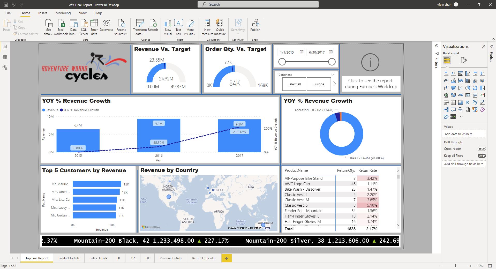
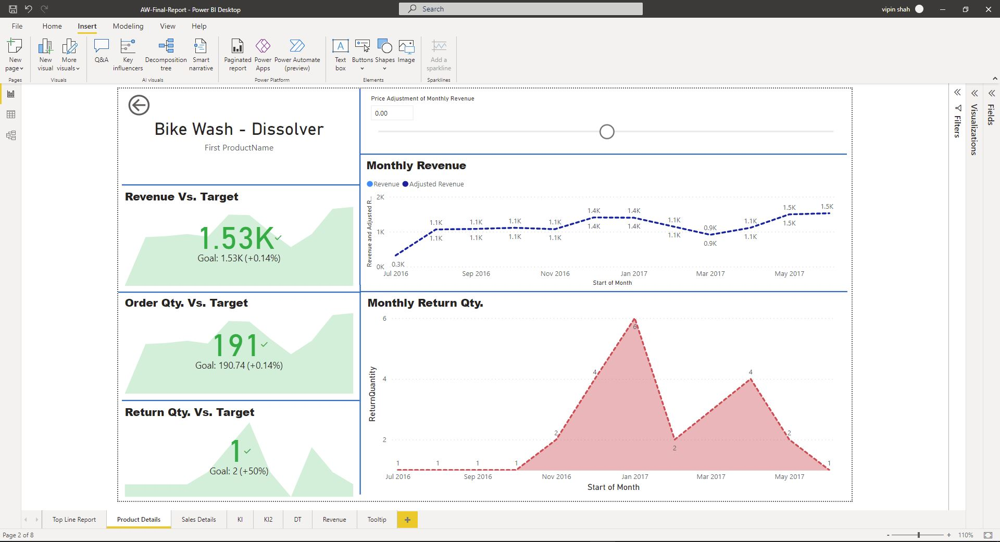
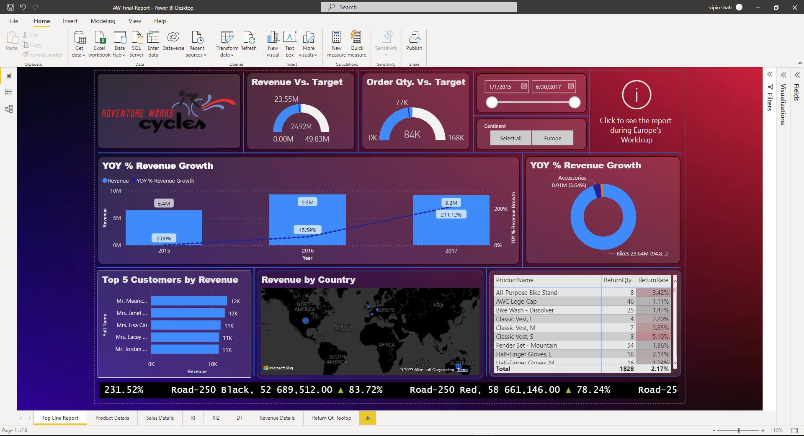
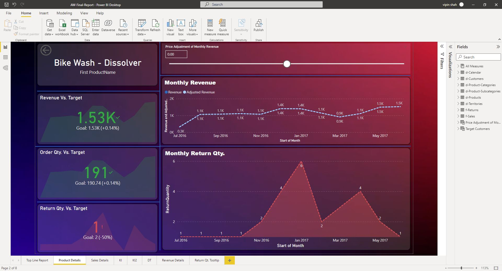
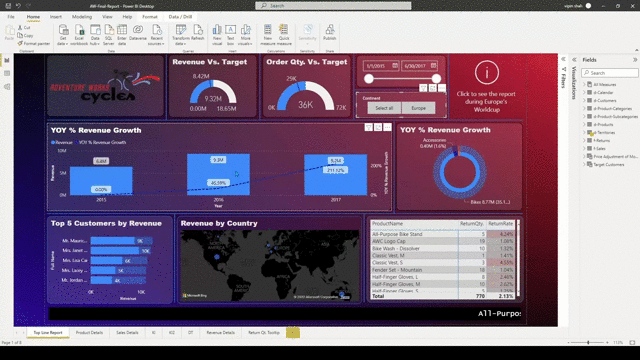

# Adventure Works Insights PowerBi Dashboard

`About Company`
- this company sells bikes , it's accessories , clothing , etc. 
- they sell in multiple countries , multiple customers & they're also getting returns
- They're maintaining the data in good manner which is stored in flat file i.e CSV file
    
## About DATASET

- `AdventureWorks-calender.csv` : contains dates data 
- `adventureWorks-territories.csv` : contains data related to territories/countries
- `AW-Sales` folder : 
    - contains adventureWorks-sale-2015.csv , adventureWorks-sale-2016.csv , adventureWorks-sale-2017.csv
    - contains sales data of 2015 , 2016 , 2017
    - & each files contains key columns i.e productKey , customerKey , territoryKey which is most important  
        because based on these columns we'll be doing data modelling to connect with other tables/data
- `AdventureWorks-Products.csv` : contains columns like productKey column , productCost & ProductPrice
    - based on these columns we'll find the revenue & profit + loss 
    - ProductSubcategoryKey column also important which is linked  
        with `AdventureWorks-Product-Subcategories.csv` file 
- `AdventureWorks.Returns.csv` : contains data related to Returns
- `AdventureWorks-Product-categories.csv` : contains different categories of products
- `AdventureWorks-Customers.csv` : 
    - contains data of customers , target customers & which kind-of products they're buying 
- `Logo of the company` : logo for branding purpose

## Problem statement

The sales director of the company is facing a lot of issues in terms of understanding how the business is performing  
and what are all the problem company is facing currently as the sales are not as expected and declining gradually  
And whenever he calls the regional managers to get the current status of the sales and market, as a human behaviour,
these people sugar cote the truth and send tons of Excel files instead of disclosing the truth, which made the sales director more frustrated.
Humans are not comfortable in consuming numbers from excel files, which is obvious reason for the frustration.  

## Solution

Sales director of the Adventure-Works company decided to build a PowerBI Dashboard for converting the data  
into visual representation to make data driven decisions. so that top management means decision maker of this company can 
easily see the data based on visualization reports & then make the informed decisions.  
So, he hired a team of data people to complete this task. So the following tasks are given below 

- `Tasks`
    - [x] which products are begin preferred by customers
    - [x] which products are returned a lot
    - [x] which shops are doing good
    - [x] year on year comparison

## Steps Followed in this project

1. Performed a High level analysis of data in Excel to get better understanding over the data.
2. Connected the folder data-set to PowerBI Desktop
3. Performed ETL and data cleaning on the imported data. 
4. Manually Build the relationship b/w different tables in PowerBi Desktop
5. Created measure for needs and used them for creating visuals in PowerBi Desktop

## Final result

`About PBI Dashboard pages`
- [x] `Top Line Report` : contain major information about this company
- [x] `Product Details` : dedicated page for only Products information
- [x] `Sales Details` : dedicated page for sales details made through `Q&A` AI visual which is NLQ 
- [x] `KI , KI2` : two separate pages to See which factors affect that metric being analyzed
- [x] `DT` : this page lets you visualize data across multiple dimensions of revenue 
- [x] `Revenue Details` : this page tells revenue based on the category name for each individual year
- [x] `Return Qty. Tooltip` : this page we used for as tooltip on other  

### Initial Dashboard

---

- Other Dashboards
    - [x] [Sales Details](./PowerBi-Dashboard/1-initial-PBI-dashboard/sales-details-page-3.jpg)
    - [x] [key influencer page 1](./PowerBi-Dashboard/1-initial-PBI-dashboard/key-influencer-page-1.jpg)
    - [x] [key influencer page 2](./PowerBi-Dashboard/1-initial-PBI-dashboard/key-influencer-page-2.jpg)
    - [x] [Decomposition Tree](./PowerBi-Dashboard/1-initial-PBI-dashboard/decomposition-tree.jpg)
    - [x] [Revenue Details](./PowerBi-Dashboard/1-initial-PBI-dashboard/revenue-details.jpg)
    - [x] [Return Quantity Tooltip](./PowerBi-Dashboard/1-initial-PBI-dashboard/Return-Quantity-tooltip-page.jpg)

### Updated Dashboard

---

### Interactive Dashboard

---

